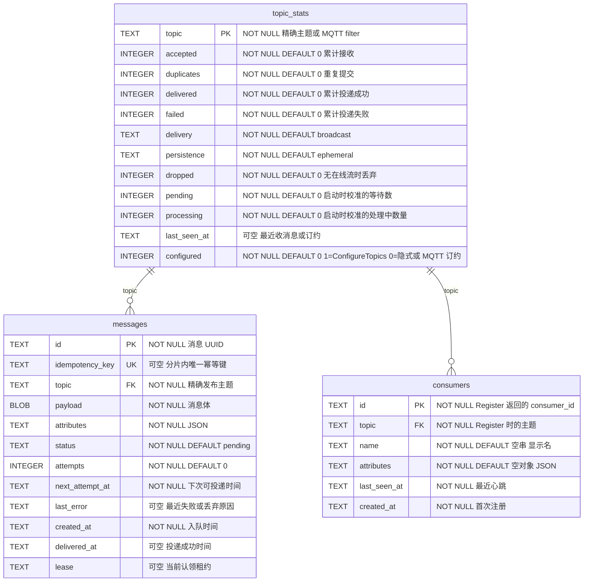

# cangling-broker

A small, Kafka-like building block. Producers and consumers use **gRPC streams**, and the same queue also speaks **MQTT 3.1.1** over TCP and WebSocket. The service commits each publish to SQLite first, then delivers it according to the topic mode.

Unconfigured topics default to **broadcast** + **ephemeral** (MQTT-style: every live stream gets a copy; a publish with nobody listening is dropped). Set a topic to **single** for competing consumers (one live stream gets each message). Set a topic to **persistent** to queue and deliver later. `Register` only stores extra consumer metadata. `DOWNSTREAM_URL` is an optional HTTP fallback when a **persistent** topic has no live stream.

Set `CL_BROKER_AUTH_TOKEN` on the broker for production. Clients must send the same value as `authorization: Bearer <token>` (or `--token` / `CL_BROKER_AUTH_TOKEN`). Unset keeps the broker open.

## Run it

```bash
# Terminal 1: broker
CL_BROKER_AUTH_TOKEN=change-me CL_BROKER_DATA=./data cargo run

# Terminal 2: consume on a gRPC stream
cargo run --example receiver
```

### Docker: start the broker, then subscribe and consume

The client dials out over gRPC, so port publish is enough:

```bash
# Terminal 1 — broker
docker run --rm --name cangling-broker \
  -p 7500:7500 -p 7501:7501 -p 7883:7883 -p 8083:8083 \
  -e CL_BROKER_AUTH_TOKEN=change-me \
  -v cangling-data:/data \
  docker.io/mapway/cangling-broker:latest
```

Harbor:

```bash
docker run --rm --name cangling-broker \
  -p 7500:7500 -p 7501:7501 -p 7883:7883 -p 8083:8083 \
  -e CL_BROKER_AUTH_TOKEN=change-me \
  -v cangling-data:/data \
  harbor.cangling.cn:22002/cangling/cangling-broker:latest
```

```bash
# Terminal 2 — subscribe / consume (Register metadata, then Subscribe stream)
cd .test
../.venv/bin/python test_subscriber.py \
  --broker 127.0.0.1:7500 \
  --topic cangling-test \
  --name s0 \
  --token change-me
```

```bash
# Terminal 3 — publish one message on AcceptMessages stream
cd .test
../.venv/bin/python test_client.py \
  --broker 127.0.0.1:7500 \
  --topic cangling-test \
  --text hello \
  --count 1 \
  --token change-me
```

The subscriber should print `s0 received | <message_id> | hello`. Status UI: [http://127.0.0.1:7501/?token=change-me](http://127.0.0.1:7501/?token=change-me).

Rust consumer:

```bash
cargo run --example receiver -- --broker-addr http://127.0.0.1:7500 --topic cangling-test
```

The image listens on `7500` (gRPC), `7501` (status), `7883` (MQTT TCP), and `8083` (MQTT WebSocket) and stores SQLite under `/data`. Map `1883:7883` if you want the standard MQTT port on the host.

### Java client (`cn.mapway.broker`)

Maven module in [`java/`](java/). Coordinates: `cn.mapway:cangling-broker`. Produce on `AcceptMessages`, consume on `Subscribe`. `Register` is optional metadata.

`SatwayClient.connect(...)` starts reconnect immediately. The channel is kept alive; `send` / `register` / `ack` retry with backoff while the broker is down; each `subscribe` stream reopens on the same `consumer_id` after a drop. Call `close()` to stop.

When the broker has `CL_BROKER_AUTH_TOKEN`, pass the same value: `SatwayClient.connect(broker, token)`, `--token`, or the `CL_BROKER_AUTH_TOKEN` environment variable. The client sends `authorization: Bearer <token>` on every RPC.

```xml
<dependency>
  <groupId>cn.mapway</groupId>
  <artifactId>cangling-broker</artifactId>
  <version>0.1.2</version>
</dependency>
```

```bash
cd java
mvn -q package
```

```bash
# consume
mvn -q exec:java \
  -Dexec.mainClass=cn.mapway.broker.example.ConsumerMain \
  -Dexec.args="--broker 127.0.0.1:7500 --topic cangling-test --name java-s0 --token change-me"

# produce
mvn -q exec:java \
  -Dexec.mainClass=cn.mapway.broker.example.ProducerMain \
  -Dexec.args="--broker 127.0.0.1:7500 --topic cangling-test --text hello --count 1 --token change-me"
```

In your own code:

```java
import cn.mapway.broker.Consumer;
import cn.mapway.broker.SatwayClient;
import cn.mapway.broker.SubscribeOptions;
import cn.mapway.broker.TopicConfig;

import java.util.List;

try (SatwayClient client = SatwayClient.connect("127.0.0.1:7500", "change-me", connected -> {
    connected.configureTopics(List.of(
            TopicConfig.single("jobs"),
            TopicConfig.ephemeral("live-events", TopicConfig.BROADCAST)));
})) {
    client.send("cangling-test", "hello");
    try (Consumer consumer = client.subscribe(
            SubscribeOptions.topic("cangling-test").name("worker-1").concurrency(10).build(),
            message -> System.out.println(message.id() + " " + message.payload()))) {
        Thread.currentThread().join();
    }
}
```

`onConnected` also runs after a reconnect, so topic config is applied again when the broker comes back. You can register later with `client.onConnected(...)`; if the channel is already ready, that listener runs immediately.

`SubscribeOptions.concurrency(10)` opens ten parallel subscription streams. Use concurrency greater than one only for `single` topics, and make the message handler thread-safe. Keep the default concurrency of one for `broadcast` topics, where every stream receives a copy.

### Python client (`cangling_broker`)

Module in [`python/`](python/). Package: `cangling-broker`. Same API as Java: produce on `AcceptMessages`, consume on `Subscribe`. Published to [PyPI](https://pypi.org/project/cangling-broker/).

```bash
pip install cangling-broker
```

```python
from cangling_broker import SatwayClient, SubscribeOptions

with SatwayClient.connect("127.0.0.1:7500", "change-me") as client:
    client.send("cangling-test", "hello")
    with client.subscribe(
            SubscribeOptions(topic="cangling-test", name="worker-1"),
            lambda message: print(message.id, message.payload)):
        ...
```

```bash
# consume
python python/examples/consumer.py --broker 127.0.0.1:7500 --topic cangling-test --name py-s0 --token change-me

# produce
python python/examples/producer.py --broker 127.0.0.1:7500 --topic cangling-test --text hello --count 1 --token change-me
```

CI runs only on a `v*` tag push (when you run `./release.sh`). It compiles on **x86_64** (`ubuntu-latest`) and **aarch64** (`ubuntu-24.04-arm`), caches the Cargo output, then publishes Docker, Maven Central, and PyPI. Normal commits, branch pushes, and pull requests do not trigger CI. Images:

- `docker.io/mapway/cangling-broker:latest`
- `harbor.cangling.cn:22002/cangling/cangling-broker:latest`

### Release

```bash
./release.sh
```

Each run bumps the patch version in `Cargo.toml`, `java/pom.xml`, and `python/pyproject.toml` (`0.1.0` → `0.1.1`), commits `Release v0.1.1`, tags `v0.1.1`, and pushes both. The workflow triggers only on the `v*` tag push, so the branch commit does not run CI. Do not put `[skip ci]` on the commit: GitHub would skip the tag push as well. The tag run compiles and publishes Docker, `cn.mapway:cangling-broker` to Maven Central, and `cangling-broker` to PyPI. Docker images are not published from `main`.

Set these repository secrets:

| Secret | Used for |
| --- | --- |
| `DOCKERHUB_USERNAME` | Docker Hub login |
| `DOCKERHUB_TOKEN` | Docker Hub access token |
| `HARBOR_USERNAME` | Harbor user or robot account |
| `HARBOR_PASSWORD` | Harbor password or robot token |
| `CENTRAL_USERNAME` | Maven Central user-token username |
| `CENTRAL_PASSWORD` | Maven Central user-token password |
| `GPG_PRIVATE_KEY` | Armored GPG private key that signs the jars |
| `GPG_PASSPHRASE` | Passphrase for that GPG key |
| `PYPI_API_TOKEN` | PyPI API token that publishes `cangling-broker` |

The gRPC API definition is [`proto/queue.proto`](proto/queue.proto). Generate a client in your preferred language from that contract; the endpoint defaults to `127.0.0.1:7500`.

Broker internals are on a separate HTTP port (`CL_BROKER_WEBPORT`, default `7501`):

```bash
# dashboard (pass the token when CL_BROKER_AUTH_TOKEN is set)
open 'http://127.0.0.1:7501/?token=change-me'

curl -s http://127.0.0.1:7501/health
curl -s -H 'authorization: Bearer change-me' http://127.0.0.1:7501/status
```

`/` is a single HTML page that refreshes from `/status`. `/status` is the JSON and includes `version`, `git`, `built`, and `db_bytes` (the control database plus all 16 message shards and their WAL/SHM sidecars). Each `clients[]` entry includes `version` when the client sent `x-client-version` (Java/Python SDKs do this automatically) or, for MQTT, the protocol version (`3.1` / `3.1.1`). Official SDKs also send `x-client-host` (Docker `HOSTNAME`, or use `CL_BROKER_CLIENT_HOST` to override) so the dashboard can tell containers apart when they all NAT through the same gateway IP. `consumers` / `streams` is the number of live `Subscribe` streams. The dashboard card **SQLite** shows the same size. Click a **persistent** topic to open its consumers and browse saved messages (`GET /messages?topic=...&offset=0`, offset `0` is the latest). Ephemeral topics do not store payloads. **清空** on a topic row deletes that topic's messages (`DELETE /messages?topic=...`) and resets its counters.

The header links to three pages: **消息** (status overview, connected clients, topics and per-topic message browsing), **缓存** (cache key lookup / write / delete / increment plus a full key list), and **分布式锁** (lock status / acquire / renew / release plus a full lock list). The cache and lock pages refresh from `GET /cache/keys` and `GET /lock/list`.

Behind a reverse proxy at `/msg/`, open `/msg/?token=change-me`. The page calls `status` next to itself (`/msg/status`), not `/status` on the site root. If nginx strips the prefix (`proxy_pass http://broker:7501/;`), that is enough. If the proxy forwards `/msg/status` unchanged, set `CL_BROKER_WEB_BASE=/msg` so the broker also serves the dashboard and JSON under that prefix.

### Competing consumers

```bash
# Two workers on the same topic — each message is sent on only one Subscribe stream
cd .test
../.venv/bin/python test_subscriber.py --topic cangling-test --name s0
../.venv/bin/python test_subscriber.py --topic cangling-test --name s1

# Publish
../.venv/bin/python test_client.py --text hello --count 1
```

On a **single** topic, each message is claimed by one live stream. On a **broadcast** topic, every live stream gets a copy; the message is delivered when all of them ack. If a subscriber disconnects or does not acknowledge before `ACK_TIMEOUT_SECS`, that delivery is retried. Current Java and Python SDKs combine acknowledgements for up to 2 ms / 64 messages and call `AckMessages`; `AckMessage` remains compatible with older clients. Use `message_id` to make handling idempotent. Delivery is at-least-once.

### Topic delivery mode

Unconfigured topics are `broadcast` + `ephemeral`. Configure many topics at once:

```bash
curl -s -H 'authorization: Bearer change-me' \
  -H 'content-type: application/json' \
  -d '{"topics":[
        {"topic":"jobs","delivery":"single","persistence":"persistent"},
        {"topic":"alerts","delivery":"broadcast","persistence":"persistent"},
        {"topic":"live-events","delivery":"broadcast","persistence":"ephemeral"}
      ]}' \
  http://127.0.0.1:7501/topics

curl -s -H 'authorization: Bearer change-me' http://127.0.0.1:7501/topics
```

gRPC: `ConfigureTopics` / `ListTopics`. Java: `client.configureTopics(List.of(TopicConfig.broadcast("alerts"), TopicConfig.single("jobs"), TopicConfig.ephemeral("live-events", TopicConfig.BROADCAST)))`. Python: `client.configure_topics([TopicConfig("alerts", "broadcast"), TopicConfig("jobs", "single"), TopicConfig("live-events", "broadcast", "ephemeral")])`.

### Topic persistence

On a **persistent** topic the broker stores the message and delivers it later, including via `DOWNSTREAM_URL` when nobody is subscribed. Configure `persistence` to opt into this; unconfigured topics stay ephemeral.

On an **ephemeral** topic the broker delivers only to live `Subscribe` streams. If nobody is connected at publish time, the message is dropped (not queued, no HTTP fallback). A later subscriber does not receive those dropped messages. `delivery` still applies among whoever is connected: `single` sends to one live stream, `broadcast` sends a copy to every live stream.

## Delivery contract

The consumer receives one `SatwayMessage` on the `Subscribe` stream:

```json
{
  "message_id": "uuid",
  "topic": "hazard-detection",
  "payload": "...",
  "attributes": { "projectId": "p-123" },
  "created_at": "2026-08-14T00:00:00Z",
  "lease": "claim-token"
}
```

Call `AckMessage` with that `message_id` and `lease`. `success = true` marks the message delivered; `success = false` or a timeout requeues it. This is **at-least-once delivery**: receivers should use `message_id` to make handling idempotent. Pass an `idempotency_key` on `AcceptMessages` to make producer retries safe.

## Cache & lock (Redis replacement)

The broker also serves a small Redis replacement: an **in-memory** string KV cache
with TTL and atomic increment, plus **SQLite-backed** distributed locks. It is exposed
over gRPC (`dispatcher.v1.CacheService`) and over the status port under `/cache*` and
`/lock*`. Values are binary-safe bytes; `Incr` treats the stored value as an integer.

The cache lives in process memory (never touching SQLite), so reads and writes are
fast. Its size is bounded by `CL_BROKER_CACHE_MAX_ENTRIES` (default 100000); when full,
the least recently used entries are evicted. Cache entries are **not** persisted and
are lost on broker restart. Locks, by contrast, stay on SQLite so a restart cannot
silently drop a lease held by a running job.

TTL semantics match Redis: `Ttl` returns `-2` for a missing key, `-1` for a key
without expiry, and the remaining seconds otherwise. Locks require an `owner` token;
`release` and `renew` only succeed for the owner that holds the lock, and a lease
never outlives its `ttl_seconds` (so a crashed holder cannot deadlock others).

HTTP (same Bearer token as the rest of the dashboard):

```bash
curl -s -H 'authorization: Bearer change-me' 'http://127.0.0.1:7501/cache?key=jobs:count'
curl -s -H 'authorization: Bearer change-me' 'http://127.0.0.1:7501/cache/keys'
curl -s -X PUT -H 'authorization: Bearer change-me' -H 'content-type: application/json' \
  -d '{"key":"session:u1","value":"hello","ttl_seconds":300}' http://127.0.0.1:7501/cache
curl -s -X POST -H 'authorization: Bearer change-me' -H 'content-type: application/json' \
  -d '{"key":"jobs:count","delta":1,"ttl_seconds":60}' http://127.0.0.1:7501/cache/incr
curl -s -X POST -H 'authorization: Bearer change-me' -H 'content-type: application/json' \
  -d '{"lock_key":"import:dataset","owner":"u1","ttl_seconds":30}' http://127.0.0.1:7501/lock/acquire
curl -s -H 'authorization: Bearer change-me' 'http://127.0.0.1:7501/lock/list'
curl -s -X DELETE -H 'authorization: Bearer change-me' \
  'http://127.0.0.1:7501/lock?lock_key=import:dataset&owner=u1'
```

Java:

```java
try (SatwayClient client = SatwayClient.connect("127.0.0.1:7500", "change-me")) {
    client.cacheSet("session:u1", "hello", 300);
    String value = client.cacheGetString("session:u1");
    long n = client.cacheIncr("jobs:count", 1, 60);
    try (LockHandle lock = client.acquireLock("import:dataset", 30)) {
        if (lock != null) lock.renew(30);
    }
}
```

Python:

```python
with SatwayClient.connect("127.0.0.1:7500", "change-me") as client:
    client.cache_set("session:u1", "hello", ttl_seconds=300)
    value = client.cache_get_string("session:u1")
    n = client.cache_incr("jobs:count", 1, ttl_seconds=60)
    lock = client.acquire_lock("import:dataset", 30)
    if lock:
        with lock:
            lock.renew(30)
```

## Performance benchmark

The baseline and the phase-one optimized implementation were measured on
**2026-09-26**. It measures the broker and its SQLite persistence path on one
host; it is not a capacity guarantee for a different disk, network, container
limit, or message-retention policy.

Test environment:

- Intel Core i9-14900HX, 24 physical / 32 logical CPUs, 31 GiB RAM
- local NVMe-backed ext4 filesystem
- `cargo build --release --locked --bin cangling-broker`; identical host and test harness
- MQTT disabled; authentication disabled; `WORKER_POLL_MS=5`
- `single + persistent` topics, unique idempotency key per message
- long-lived bidirectional gRPC producer streams, 16 in-flight messages per stream
- three rounds per case; the table reports the median result

| Workload | Streams | Payload | v0.1.55 baseline | Phase one | Change |
| --- | ---: | ---: | ---: | ---: | ---: |
| Persistent publish | 1 producer | 256 B | 903 msg/s | 2,071 msg/s | +129% |
| Persistent publish | 4 producers | 256 B | 1,415 msg/s | 2,674 msg/s | +89% |
| Persistent publish | 16 producers | 256 B | 1,846 msg/s | 3,153 msg/s | +71% |
| Persistent publish | 4 producers | 4 KiB | 1,312 msg/s | 2,384 msg/s | +82% |
| Publish, consume and ACK | 4 producers + 4 consumers | 256 B | 351 msg/s | 729 msg/s | +108% |

Phase-one latency:

| Workload | P50 | P95 | P99 |
| --- | ---: | ---: | ---: |
| 1 producer, 256 B | 5.85 ms | 15.24 ms | 37.15 ms |
| 4 producers, 256 B | 17.18 ms | 48.54 ms | 54.24 ms |
| 16 producers, 256 B | 52.06 ms | 98.96 ms | 112.18 ms |
| 4 producers, 4 KiB | 20.17 ms | 46.50 ms | 52.00 ms |
| 4 producers + 4 consumers, 256 B | 50.75 ms | 146.08 ms | 172.22 ms |

These historical `Persistent publish` results used commit acknowledgements:
a response was returned only after the message had been committed to SQLite.
Latency was measured from placing a request on the gRPC stream until its
matching response was received. `Publish, consume and ACK` throughput ends when
all messages have been acknowledged successfully by the consumers; its latency
columns describe the publish side, while the throughput covers the complete
write-deliver-ACK path.

Phase one adds a bounded concurrent intake per gRPC stream, a single bounded
SQLite writer, short batched transactions for enqueue and delivery completion,
atomic exact-topic claims, an in-memory topic configuration cache, and
configurable consumer prefetch. Publish responses are still returned only after
the containing transaction commits, so the durability contract is unchanged.
The three optimized rounds accepted 67,500 messages with 0 failed and 0
duplicate messages. The active SQLite main/WAL/SHM footprint at the end was
approximately 152 MB, compared with approximately 405 MB after the similarly
sized baseline run; this is a transient WAL observation, not a per-message
storage-size guarantee.

Four streams remain a balanced default for latency-sensitive workloads on this
machine.

Phase two adds a backward-compatible `AckMessages` RPC and asynchronous ACK
coalescing to both official SDKs (up to 64 acknowledgements or 2 ms), topic
notifications for committed messages, and in-memory incremental pending /
processing counters rebuilt from SQLite at startup. Persistent subscribers now
wake immediately after commit instead of polling SQLite continuously; the
30-second query is only a recovery safety net. `/status` no longer executes a
full `GROUP BY topic, status` over `messages`.

A release-mode A/B run on the same host preloaded 10,000 persistent 256-byte
messages, then drained them with four Python consumers. The old one-unary-RPC-
per-message path completed at **253.9 msg/s**; the phase-two SDK completed at
**275.3 msg/s** (**+8.4%**) with `pending=0`, `processing=0`, and 10,000
delivered. Publish-only intake in those runs was 11,828–14,936 msg/s. This A/B
isolates acknowledgement protocol overhead; it is intentionally separate from
the simultaneous producer/consumer phase-one workload above.

Persistent messages use **16 fixed SQLite shards** named `queue-00.db` through
`queue-15.db`. A stable FNV-1a hash of the exact topic selects the shard, so one
topic remains ordered and always returns to the same file after restart or
upgrade. Each shard has an independent bounded writer and WAL; the configured
write queue capacity is divided across them rather than multiplied by 16.
Exact-topic operations touch one shard. Wildcard subscriptions rotate fairly
across all shards. New message IDs contain the shard prefix (`s07-...`) so ACKs
route without a lookup.

On the first sharded startup, rows from the legacy `queue.db.messages` table are
copied and verified before a `message-shards-v1` migration marker is written.
The legacy rows are deliberately retained as a rollback copy and are no longer
used by the running broker; no automatic destructive cleanup is performed.

The shard commit path does not synchronously update the control database.
Accepted, duplicate, and delivered counters are accumulated in memory and
flushed to `queue.db` in one transaction every 100 ms. Status reads, cleanup,
and graceful shutdown force a final flush. Queue depth remains an immediate
in-memory counter and startup reconciles it from the shard files.

The current high-throughput mode acknowledges persistent publishes as soon as
their shard's **bounded in-memory queue** accepts them. The shard writer commits
batches to SQLite in the background and wakes subscribers only after a
successful commit. Queue admission applies backpressure when
`CL_BROKER_WRITE_QUEUE_SIZE` is full, and graceful shutdown drains admitted
commands before closing SQLite. This deliberately uses a Redis-style
asynchronous durability trade-off: an abrupt process or host failure can lose
the short, not-yet-committed window. A publish response is therefore not an
`fsync` guarantee. Producer retries are detected by a bounded in-process recent
idempotency-key table, restored from every shard at startup, and remain enforced
by SQLite at commit time. Transient SQLite write failures retain the batch and
retry with bounded exponential backoff instead of discarding acknowledged data.

### 三机架构性能测试

2026-09-26 使用同一局域网中的三台 x86_64 服务器对 Release 版本进行测试，
每台服务器配置为 4 vCPU、62 GiB 内存。测试拓扑如下：

```text
192.168.3.122 ── Rust gRPC 压测客户端 ──┐
                                        ├─→ 192.168.3.121:17500
192.168.3.123 ── Rust gRPC 压测客户端 ──┘      cangling-broker
                                                  │
                                                  ├─ 16 个有界内存队列
                                                  └─ 16 个 SQLite WAL 分片
```

测试使用 256 字节消息、16 条并发 gRPC 生产者流、131,072 条有界内存队列和
每批最多 1,024 条的 SQLite 后台事务。测试端口和数据目录与服务器上的已有服务
完全隔离。

| 测试场景 | 消息数量 | 完成时间/吞吐 | 主要限制 |
| --- | ---: | ---: | --- |
| 内存队列接纳 | 64,000 | 0.482 秒，约 **132,800 msg/s** | gRPC、内存入队和响应 |
| 超过队列容量的持续写入 | 320,000 | 约 **16,900 msg/s** | SQLite WAL 与磁盘写入 |

第一项衡量生产者收到异步接纳响应的速度，表示短时突发流量处理能力；第二项消息
总量超过内存队列容量，背压会把速度限制到后台持久化能力，更接近长时间持续写入
时的吞吐上限。因此不能用 132,800 msg/s 作为磁盘可持续写入能力。

两轮测试共确认 **384,000 条消息**。等待后台队列排空后，16 个 SQLite 分片中
共存在 384,000 条；向 broker 发送正常关闭信号后再次检查，数量仍为 384,000，
没有发现消息遗漏。测试期间 broker 没有持久化错误日志，观察到的峰值 RSS 约为
279 MiB。以上结果反映本次测试服务器和磁盘的性能，不等同于其他部署环境的容量
保证；网络存储、容器磁盘限速、消息大小、鉴权和消费者处理速度都会改变结果。

### 随机消息长度分布式性能测试

2026-09-26 使用 `192.168.3.121`、`192.168.3.122`、`192.168.3.123`
和 `192.168.3.215` 四台主机测试。`121` 运行 Release Broker，`122`、`123`
和 `215` 各运行 8 条并发 Rust gRPC 生产者流，共 24 条流。消息体长度在
**10–2,046 字节**之间均匀随机生成，平均约 1,028 字节；每条消息使用唯一幂等键
并写入独立的持久化测试主题。

```text
192.168.3.122 ── 8 streams ──┐
192.168.3.123 ── 8 streams ──┼─→ 192.168.3.121:17500
192.168.3.215 ── 8 streams ──┘      cangling-broker
```

Broker 使用 16 个 SQLite WAL 分片、262,144 条有界写队列、每批最多 1,024 条、
2 ms 批等待和 1,024 个流内并发。测试使用独立端口和临时数据目录，没有影响主机
上已有 Broker。

| 测试场景 | 消息数量 | 结果 | 说明 |
| --- | ---: | ---: | --- |
| 队列内突发接纳 | 192,000 | 约 **234,400 msg/s** | 三客户端分别为 93,931、91,865 和 83,850 msg/s；聚合值按首个启动到最后完成的 0.819 秒计算 |
| 超过队列容量的持续接纳 | 288,000 | 8.578 秒，约 **33,575 msg/s** | 总量超过队列容量，包含 SQLite 背压 |
| 持续轮次完全持久化 | 288,000 | 约 25.3 秒，约 **11,400 msg/s** | 从客户端同时启动到 16 个分片全部可查询，包含约 16.13 秒后台排空和采样开销 |

突发轮次最终精确落盘 192,000 条，正常关闭后仍为 192,000 条。持续轮次使用全新
数据库，最终在 16 个 SQLite 分片中精确查到 **288,000 条消息**；正常关闭后再次
检查仍为 288,000 条。两轮均未发现消息遗漏。持续轮次数据库文件合计约 507 MiB，
排空结束时 Broker RSS 约 537 MiB、线程数 41。

随机约 1 KiB 消息的磁盘持续吞吐明显低于前一节的固定 256 字节测试，说明消息体
大小、SQLite 页写入和测试磁盘是长期吞吐的重要约束。队列内突发接纳数字只表示
短时吸收能力；容量规划应采用“完全持久化”结果，并在实际部署磁盘上复测。

A 2026-09-26 release build test used 256-byte persistent messages on local
storage. One producer stream sustained 12,324–16,887 msg/s across repeated
32,000-message runs. With 16 simultaneous streams, one shared shard sustained
3,317 msg/s while 16 independently routed shards sustained 5,050 msg/s
(+52%). The result shows that sharding helps under equal producer concurrency,
but extra streams and multiple WAL writers do not scale linearly on one physical
disk. Measure again on the deployment volume before choosing producer
parallelism.

For deployment sizing, rerun the same workload on the target volume and with
production authentication, network latency, retention settings, payload sizes,
and consumer processing time. In particular, network filesystems and
write-limited container volumes can behave very differently from local NVMe.

## Configuration

| Environment variable | Default | Purpose |
| --- | --- | --- |
| `CL_BROKER_PORT` | `7500` | gRPC listener `0.0.0.0:<port>` |
| `CL_BROKER_WEBPORT` | `7501` | HTTP status/dashboard (`GET /`, `GET /status`, `GET /health`, `GET /messages`, `/cache*`, `/lock*`) |
| `CL_BROKER_WEB_BASE` | unset | optional path prefix (`/msg`) when a proxy forwards `/msg/...` without stripping it. `/` and `/health` stay at the root |
| `CL_BROKER_MQTT_ENABLED` | `true` | accept MQTT 3.1.1 clients; `false` disables both MQTT listeners |
| `CL_BROKER_MQTT_PORT` | `7883` | MQTT TCP listener. `0` disables TCP. Unprivileged default; map `1883:7883` or set `1883` if you can bind it |
| `CL_BROKER_MQTT_WSPORT` | `8083` | MQTT WebSocket listener (`/mqtt`). `0` attaches `GET /mqtt` to the status port |
| `CL_BROKER_AUTH_TOKEN` | unset | shared secret; when set, gRPC, `/` `/status`, and MQTT `CONNECT` require it. `/health` stays open |
| `CL_BROKER_DATA` | unset (image: `/data`) | data dir; control DB is `<dir>/queue.db`, message shards are `<dir>/queue-00.db` … `queue-15.db`, logs are `<dir>/logs` |
| `DOWNSTREAM_URL` | unset | optional HTTP POST fallback when a topic has no live `Subscribe` stream |
| `WORKER_POLL_MS` | `500` | queue polling interval |
| `CL_BROKER_WRITE_BATCH_SIZE` | `128` | maximum persistent enqueue/completion operations grouped for a SQLite writer cycle |
| `CL_BROKER_WRITE_BATCH_WAIT_MS` | `2` | maximum time used to collect a write batch |
| `CL_BROKER_WRITE_QUEUE_SIZE` | `8192` | bounded in-memory queue capacity before producer backpressure |
| `CL_BROKER_INGEST_INFLIGHT` | `128` | maximum concurrently processed publishes per gRPC producer stream; responses remain ordered |
| `CL_BROKER_CONSUMER_PREFETCH` | `32` | maximum unacknowledged persistent messages per subscription; set `1` for strict serial delivery |
| `MAX_DELIVERY_ATTEMPTS` | `10` | attempts before a message is marked failed |
| `MESSAGE_RETENTION_DAYS` | `10` | delete messages older than this (any status, by `created_at`); `0` keeps them forever |
| `CL_BROKER_DELIVERED_RETENTION_HOURS` | `24` | delete delivered messages whose `delivered_at` is older than this; `0` disables. Pending, failed, and dropped rows stay until `MESSAGE_RETENTION_DAYS` |
| `CL_BROKER_EPHEMERAL_IDLE_HOURS` | `1` | delete unconfigured ephemeral topic rows with no new message for this many hours; `0` disables. `ConfigureTopics` rows are kept |
| `CL_BROKER_PURGE_INTERVAL_HOURS` | `1` | how often idle-topic purge runs; `0` runs it on every 60s sweep |
| `ACK_TIMEOUT_SECS` | `30` | how long a subscriber may take to `AckMessage` before the message is retried |
| `CONSUMER_TTL_SECS` | `60` | drop registered consumer metadata that is not seen again; `0` keeps it until `Unregister` |
| `CL_BROKER_CACHE_MAX_ENTRIES` | `100000` | max in-memory cache entries before LRU eviction |
| `LOG_MAX_BYTES` | `104857600` | rotate after this many bytes (100 MiB) |
| `LOG_KEEP_FILES` | `3` | keep this many files, including the current one |
| `CL_BROKER_LOG_MESSAGES` | `false` | when `true`, print each received message's topic and payload to the console |

```bash
docker run --rm --name cangling-broker \
  -p 7500:7500 -p 7501:7501 -p 7883:7883 -p 8083:8083 \
  -e CL_BROKER_AUTH_TOKEN=hello_world \
  -e CL_BROKER_PORT=7500 \
  -e CL_BROKER_WEBPORT=7501 \
  -e CL_BROKER_DATA=/data \
  -v cangling-data:/data \
  docker.io/mapway/cangling-broker:latest
```

### MQTT (TCP + WebSocket)

MQTT 3.1.1, QoS 0/1. Publish and subscribe share the same SQLite queue as gRPC. Topic filters support exact names, single-level `+`, and multi-level `#` (`building/#` receives `building`, `building/floor1/temp`, …). `#` must be the last level. Retain, LWT, and QoS 2 are not implemented: incoming QoS 2 is acknowledged with `PUBREC`/`PUBCOMP` but stored once like QoS 1.

When `CL_BROKER_AUTH_TOKEN` is set, send it as the MQTT password (or username).

```bash
# subscribe (TCP)
mosquitto_sub -h 127.0.0.1 -p 7883 -t 'building/#' -P change-me

# publish (TCP)
mosquitto_pub -h 127.0.0.1 -p 7883 -t cangling-test -m hello -q 1 -P change-me
```

Browser / mqtt.js:

```js
import mqtt from "mqtt";
const client = mqtt.connect("ws://127.0.0.1:8083/mqtt", { password: "change-me" });
client.subscribe("cangling-test");
client.publish("cangling-test", "hello");
```

A gRPC `AcceptMessages` publish is delivered to MQTT subscribers on that topic, and the other way around.

## 数据库 ER

`topic_stats`、`consumers` 和管理表位于 `<data>/queue.db`；`messages` 表位于固定的 16 个 `queue-NN.db` 分片中。没有声明跨库 `FOREIGN KEY`，逻辑外键是 `topic`。列、默认值和索引以 `src/db.rs` 为准。

`topic_stats.topic` 可以是精确名，也可以是 MQTT 订约 filter（`building/#`、`sensor/+/temp`）。`messages.topic` 永远是精确发布名。通配符订约会单独占一行 `topic_stats`（`persistence=persistent`，`configured=0`），这样 idle purge 不会删掉已订约的 filter；发布出来的子主题（如 `building/floor1/temp`）仍按 ephemeral 处理，空闲后可被回收。



`status`：`pending` / `processing` / `delivered` / `failed` / `dropped`（进程启动时会把仍为 `processing` 的行改回 `pending` 并清空 `lease`）。`delivery`：`single` 或 `broadcast`。`persistence`：`persistent` 或 `ephemeral`。

索引：

| 名称 | 列 |
| --- | --- |
| `idx_messages_ready` | `messages(status, next_attempt_at, created_at)` |
| `idx_messages_created_at` | `messages(created_at)` |
| `idx_messages_delivered` | `messages(status, delivered_at)` |
| `idx_messages_topic_ready` | `messages(topic, status, next_attempt_at, created_at)` |
| `idx_consumers_topic_seen` | `consumers(topic, last_seen_at)` |
| `messages.idempotency_key` | `UNIQUE` |

`consumers` 只存 gRPC `Register` 元数据。投递走内存里的 `Subscribe` / MQTT 会话；MQTT 订约本身写入 `topic_stats`，不写 `consumers`。`messages.idempotency_key` 在 topic 所在分片内唯一，用于 `AcceptMessages` 去重；生产者重试时必须保持同一个 topic。隐式 ephemeral 且空闲超过 `CL_BROKER_EPHEMERAL_IDLE_HOURS` 的行会被 purge 删掉；`configured=1` 和 MQTT 订约的 persistent filter 会留下。已投递且 `delivered_at` 超过 `CL_BROKER_DELIVERED_RETENTION_HOURS` 的消息行会被删掉；未投递的行仍按 `MESSAGE_RETENTION_DAYS` 清理。
