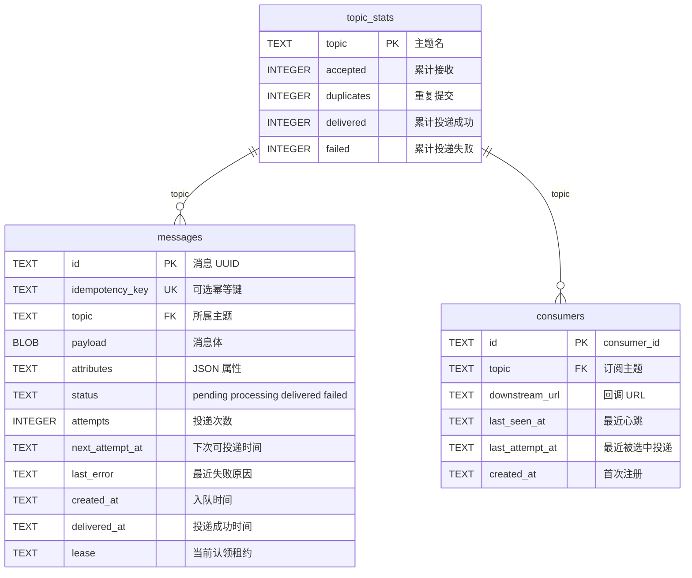

# cangling-message

A small, Kafka-like building block: gRPC clients submit a message; the service commits it to SQLite first; then the broker POSTs it to **one** registered downstream URL.

Topics are work queues, not broadcast. If several clients `Register` on the same topic, each message is delivered to exactly one of them. `DOWNSTREAM_URL` is used only for topics that currently have no registered consumer.

## Run it

```bash
# Terminal 1: a sample downstream application that registers its HTTP URL
cargo run --example receiver

# Terminal 2: the durable gRPC queue
DATABASE_URL=sqlite:./queue.db \
cargo run
```

### Docker: start the broker, then subscribe and consume

`--network host` lets the broker POST back to a consumer on the same machine.

```bash
# Terminal 1 — broker
docker run --rm --name cangling-message \
  --network host \
  -v cangling-data:/data \
  docker.io/mapway/cangling-message:latest
```

Harbor:

```bash
docker run --rm --name cangling-message \
  --network host \
  -v cangling-data:/data \
  harbor.cangling.cn:22002/cangling/cangling-message:latest
```

```bash
# Terminal 2 — subscribe / consume (registers an HTTP callback, then prints each message)
cd .test
../.venv/bin/python test_subscriber.py \
  --broker 127.0.0.1:7500 \
  --topic cangling-test \
  --listen 127.0.0.1:8080 \
  --name s0
```

```bash
# Terminal 3 — publish one message
cd .test
../.venv/bin/python test_client.py \
  --broker 127.0.0.1:7500 \
  --topic cangling-test \
  --text hello \
  --count 1
```

The subscriber should print `s0 received | {"id": "...", "topic": "cangling-test", "payload": "hello", ...}`. Status UI: [http://127.0.0.1:7501/](http://127.0.0.1:7501/).

Rust consumer instead of Python:

```bash
cargo run --example receiver -- --broker-addr http://127.0.0.1:7500 --topic cangling-test
```

If you publish ports instead of `--network host`, the broker cannot use `127.0.0.1` as the callback (that is inside the container). Bind the consumer on all interfaces and give a host URL:

```bash
# Terminal 1
docker run --rm --name cangling-message \
  -p 7500:7500 -p 7501:7501 \
  --add-host=host.docker.internal:host-gateway \
  -v cangling-data:/data \
  docker.io/mapway/cangling-message:latest

# Terminal 2
cd .test
../.venv/bin/python test_subscriber.py \
  --broker 127.0.0.1:7500 \
  --topic cangling-test \
  --listen 0.0.0.0:8080 \
  --callback-url http://host.docker.internal:8080/messages \
  --name s0
```

The image listens on `7500` (gRPC) and `7501` (status) and stores SQLite under `/data`.

### Java client (`cn.satway.message`)

Maven module in [`java/`](java/). It produces with `AcceptMessage` and consumes by registering an HTTP callback.

```bash
cd java
mvn -q package
```

```bash
# consume
mvn -q exec:java \
  -Dexec.mainClass=cn.satway.message.example.ConsumerMain \
  -Dexec.args="--broker 127.0.0.1:7500 --topic cangling-test --listen 127.0.0.1:8080"

# produce
mvn -q exec:java \
  -Dexec.mainClass=cn.satway.message.example.ProducerMain \
  -Dexec.args="--broker 127.0.0.1:7500 --topic cangling-test --text hello --count 1"
```

In your own code:

```java
import cn.satway.message.Consumer;
import cn.satway.message.MessageClient;

try (MessageClient client = MessageClient.connect("127.0.0.1:7500")) {
    client.send("cangling-test", "hello");
    try (Consumer consumer = client.subscribe("cangling-test", "127.0.0.1", 8080, message -> {
        System.out.println(message.id() + " " + message.payload());
    })) {
        Thread.currentThread().join();
    }
}
```

CI compiles on **x86_64** (`ubuntu-latest`) and **aarch64** (`ubuntu-24.04-arm`), caches the Cargo output for the next run, then publishes a multi-arch image to both:

- `docker.io/mapway/cangling-message:latest`
- `harbor.cangling.cn:22002/cangling/cangling-message:latest`

### Release

```bash
./release.sh
```

Each run bumps the patch version in `Cargo.toml` (`0.1.0` → `0.1.1`), commits, tags `v0.1.1`, and pushes to GitHub so Actions builds the multi-arch image.

Set these repository secrets:

| Secret | Used for |
| --- | --- |
| `DOCKERHUB_USERNAME` | Docker Hub login |
| `DOCKERHUB_TOKEN` | Docker Hub access token |
| `HARBOR_USERNAME` | Harbor user or robot account |
| `HARBOR_PASSWORD` | Harbor password or robot token |

The gRPC API definition is [`proto/queue.proto`](proto/queue.proto). Generate a client in your preferred language from that contract; the endpoint defaults to `127.0.0.1:7500`.

Broker internals are on a separate HTTP port (`STATUS_LISTEN_ADDR`, default `7501`):

```bash
# dashboard
open http://127.0.0.1:7501/

curl -s http://127.0.0.1:7501/health
curl -s http://127.0.0.1:7501/status
```

`/` is a single HTML page that refreshes from `/status`. `/status` is the JSON. There are no long-lived gRPC subscriber streams; `consumers` is the number of live registered HTTP receivers.

### Competing consumers

```bash
# Two workers on the same topic — each message is POSTed to only one of them
cd .test
../.venv/bin/python test_subscriber.py --topic cangling-test --listen 127.0.0.1:8080 --name s0
../.venv/bin/python test_subscriber.py --topic cangling-test --listen 127.0.0.1:8081 --name s1

# Publish
../.venv/bin/python test_client.py --text hello --count 1
```

A consumer must keep calling `Register` (heartbeat). `Unregister`, a missed heartbeat (`CONSUMER_TTL_SECS`), or a non-2xx POST puts the message back on the queue for another client. Use `id` to make handling idempotent; delivery is at-least-once.

## Delivery contract

The downstream receiver gets one JSON POST per message:

```json
{
  "id": "uuid",
  "topic": "hazard-detection",
  "payload": "...",
  "payload_encoding": "utf-8",
  "attributes": { "projectId": "p-123" },
  "created_at": "2026-08-14T00:00:00Z"
}
```

Any 2xx response acknowledges delivery. This provides **at-least-once delivery**: receivers should use `id` to make handling idempotent. Pass an `idempotency_key` to `AcceptMessage` to make client retries safe.

## Configuration

| Environment variable | Default | Purpose |
| --- | --- | --- |
| `GRPC_LISTEN_ADDR` | `0.0.0.0:7500` | gRPC listener |
| `STATUS_LISTEN_ADDR` | `0.0.0.0:7501` | HTTP status (`GET /`, `GET /status`, `GET /health`) |
| `DATABASE_URL` | `sqlite:./queue.db` | SQLite connection URL |
| `DOWNSTREAM_URL` | unset | fallback HTTP POST receiver when a topic has no registered consumer |
| `WORKER_POLL_MS` | `500` | queue polling interval |
| `MAX_DELIVERY_ATTEMPTS` | `10` | attempts before a message is marked failed |
| `MESSAGE_RETENTION_DAYS` | `10` | delete messages older than this; `0` keeps them forever |
| `ACK_TIMEOUT_SECS` | `30` | how long an HTTP delivery may take before the message is retried |
| `CONSUMER_TTL_SECS` | `60` | drop a consumer that does not `Register` again; `0` keeps it until `Unregister` |

## 数据库 ER

三张表都落在同一个 SQLite 文件里。没有声明 `FOREIGN KEY`，关联键是 `topic`：一个主题对应多条消息、多个消费者；`topic_stats` 是主题的聚合行。



`consumers` 还有 `UNIQUE(topic, downstream_url)`：同一主题上同一个回调地址只会有一行。`messages.idempotency_key` 全局唯一，用于 `AcceptMessage` 去重。
