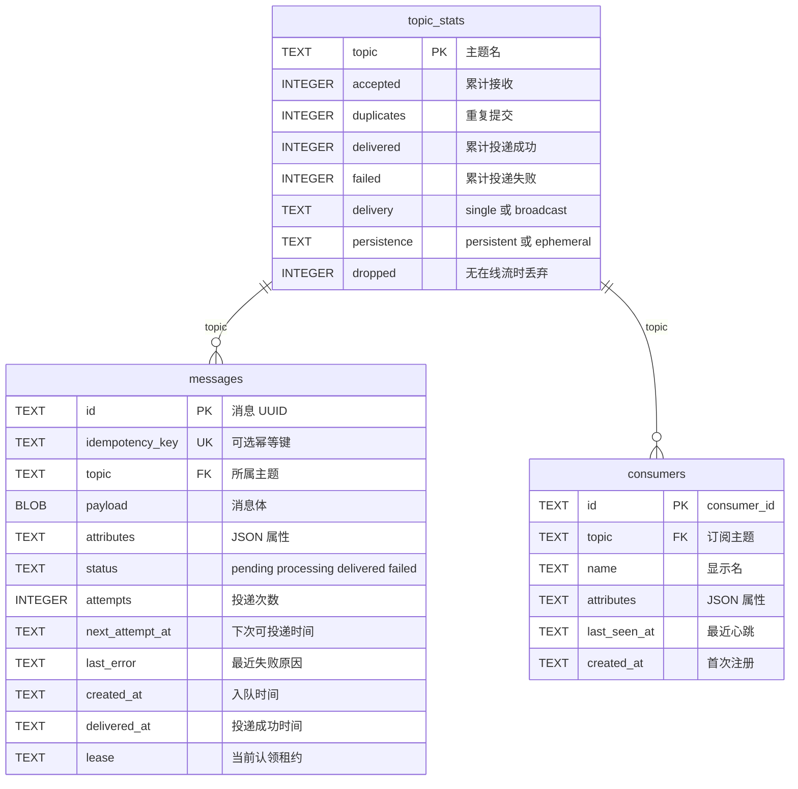

# cangling-broker

A small, Kafka-like building block. Producers and consumers both use **gRPC streams**. The service commits each publish to SQLite first, then delivers it according to the topic mode.

Topics default to **single** (competing consumers: one live stream gets each message). Set a topic to **broadcast** and every live `Subscribe` stream on that topic gets a copy. Persistence defaults to **persistent** (queue and deliver later). Set a topic to **ephemeral** and a publish with no live `Subscribe` stream is dropped. `Register` only stores extra consumer metadata. `DOWNSTREAM_URL` is an optional HTTP fallback when a **persistent** topic has no live stream.

Set `CL_BROKER_AUTH_TOKEN` on the broker for production. Clients must send the same value as `authorization: Bearer <token>` (or `--token` / `CL_BROKER_AUTH_TOKEN`). Unset keeps the broker open.

## Run it

```bash
# Terminal 1: broker
CL_BROKER_AUTH_TOKEN=change-me CL_BROKER_DATA=./data cargo run

# Terminal 2: consume on a gRPC stream
cargo run --example receiver
```

### Docker: start the broker, then subscribe and consume

The client dials out over gRPC, so port publish is enough:

```bash
# Terminal 1 — broker
docker run --rm --name cangling-broker \
  -p 7500:7500 -p 7501:7501 \
  -e CL_BROKER_AUTH_TOKEN=change-me \
  -v cangling-data:/data \
  docker.io/mapway/cangling-broker:latest
```

Harbor:

```bash
docker run --rm --name cangling-broker \
  -p 7500:7500 -p 7501:7501 \
  -e CL_BROKER_AUTH_TOKEN=change-me \
  -v cangling-data:/data \
  harbor.cangling.cn:22002/cangling/cangling-broker:latest
```

```bash
# Terminal 2 — subscribe / consume (Register metadata, then Subscribe stream)
cd .test
../.venv/bin/python test_subscriber.py \
  --broker 127.0.0.1:7500 \
  --topic cangling-test \
  --name s0 \
  --token change-me
```

```bash
# Terminal 3 — publish one message on AcceptMessages stream
cd .test
../.venv/bin/python test_client.py \
  --broker 127.0.0.1:7500 \
  --topic cangling-test \
  --text hello \
  --count 1 \
  --token change-me
```

The subscriber should print `s0 received | <message_id> | hello`. Status UI: [http://127.0.0.1:7501/?token=change-me](http://127.0.0.1:7501/?token=change-me).

Rust consumer:

```bash
cargo run --example receiver -- --broker-addr http://127.0.0.1:7500 --topic cangling-test
```

The image listens on `7500` (gRPC) and `7501` (status) and stores SQLite under `/data`.

### Java client (`cn.mapway.broker`)

Maven module in [`java/`](java/). Coordinates: `cn.mapway:cangling-broker`. Produce on `AcceptMessages`, consume on `Subscribe`. `Register` is optional metadata.

`SatwayClient.connect(...)` starts reconnect immediately. The channel is kept alive; `send` / `register` / `ack` retry with backoff while the broker is down; each `subscribe` stream reopens on the same `consumer_id` after a drop. Call `close()` to stop.

When the broker has `CL_BROKER_AUTH_TOKEN`, pass the same value: `SatwayClient.connect(broker, token)`, `--token`, or the `CL_BROKER_AUTH_TOKEN` environment variable. The client sends `authorization: Bearer <token>` on every RPC.

```xml
<dependency>
  <groupId>cn.mapway</groupId>
  <artifactId>cangling-broker</artifactId>
  <version>0.1.2</version>
</dependency>
```

```bash
cd java
mvn -q package
```

```bash
# consume
mvn -q exec:java \
  -Dexec.mainClass=cn.mapway.broker.example.ConsumerMain \
  -Dexec.args="--broker 127.0.0.1:7500 --topic cangling-test --name java-s0 --token change-me"

# produce
mvn -q exec:java \
  -Dexec.mainClass=cn.mapway.broker.example.ProducerMain \
  -Dexec.args="--broker 127.0.0.1:7500 --topic cangling-test --text hello --count 1 --token change-me"
```

In your own code:

```java
import cn.mapway.broker.Consumer;
import cn.mapway.broker.SatwayClient;
import cn.mapway.broker.SubscribeOptions;
import cn.mapway.broker.TopicConfig;

import java.util.List;

try (SatwayClient client = SatwayClient.connect("127.0.0.1:7500", "change-me", connected -> {
    connected.configureTopics(List.of(
            TopicConfig.single("jobs"),
            TopicConfig.ephemeral("live-events", TopicConfig.BROADCAST)));
})) {
    client.send("cangling-test", "hello");
    try (Consumer consumer = client.subscribe(
            SubscribeOptions.topic("cangling-test").name("worker-1").build(),
            message -> System.out.println(message.id() + " " + message.payload()))) {
        Thread.currentThread().join();
    }
}
```

`onConnected` also runs after a reconnect, so topic config is applied again when the broker comes back. You can register later with `client.onConnected(...)`; if the channel is already ready, that listener runs immediately.

### Python client (`cangling_broker`)

Module in [`python/`](python/). Package: `cangling-broker`. Same API as Java: produce on `AcceptMessages`, consume on `Subscribe`. Published to [PyPI](https://pypi.org/project/cangling-broker/).

```bash
pip install cangling-broker
```

```python
from cangling_broker import SatwayClient, SubscribeOptions

with SatwayClient.connect("127.0.0.1:7500", "change-me") as client:
    client.send("cangling-test", "hello")
    with client.subscribe(
            SubscribeOptions(topic="cangling-test", name="worker-1"),
            lambda message: print(message.id, message.payload)):
        ...
```

```bash
# consume
python python/examples/consumer.py --broker 127.0.0.1:7500 --topic cangling-test --name py-s0 --token change-me

# produce
python python/examples/producer.py --broker 127.0.0.1:7500 --topic cangling-test --text hello --count 1 --token change-me
```

CI compiles on **x86_64** (`ubuntu-latest`) and **aarch64** (`ubuntu-24.04-arm`), caches the Cargo output for the next run, then publishes a multi-arch image to both:

- `docker.io/mapway/cangling-broker:latest`
- `harbor.cangling.cn:22002/cangling/cangling-broker:latest`

### Release

```bash
./release.sh
```

Each run bumps the patch version in `Cargo.toml`, `java/pom.xml`, and `python/pyproject.toml` (`0.1.0` → `0.1.1`), commits, tags `v0.1.1`, and pushes. Deploy stays in GitHub Actions: the tag publishes Docker images, `cn.mapway:cangling-broker` to Maven Central, and `cangling-broker` to PyPI. A branch push or pull request only compiles.

Set these repository secrets:

| Secret | Used for |
| --- | --- |
| `DOCKERHUB_USERNAME` | Docker Hub login |
| `DOCKERHUB_TOKEN` | Docker Hub access token |
| `HARBOR_USERNAME` | Harbor user or robot account |
| `HARBOR_PASSWORD` | Harbor password or robot token |
| `CENTRAL_USERNAME` | Maven Central user-token username |
| `CENTRAL_PASSWORD` | Maven Central user-token password |
| `GPG_PRIVATE_KEY` | Armored GPG private key that signs the jars |
| `GPG_PASSPHRASE` | Passphrase for that GPG key |
| `PYPI_API_TOKEN` | PyPI API token that publishes `cangling-broker` |

The gRPC API definition is [`proto/queue.proto`](proto/queue.proto). Generate a client in your preferred language from that contract; the endpoint defaults to `127.0.0.1:7500`.

Broker internals are on a separate HTTP port (`CL_BROKER_WEBPORT`, default `7501`):

```bash
# dashboard (pass the token when CL_BROKER_AUTH_TOKEN is set)
open 'http://127.0.0.1:7501/?token=change-me'

curl -s http://127.0.0.1:7501/health
curl -s -H 'authorization: Bearer change-me' http://127.0.0.1:7501/status
```

`/` is a single HTML page that refreshes from `/status`. `/status` is the JSON and includes `version`, `git`, and `built`. `consumers` / `streams` is the number of live `Subscribe` streams.

### Competing consumers

```bash
# Two workers on the same topic — each message is sent on only one Subscribe stream
cd .test
../.venv/bin/python test_subscriber.py --topic cangling-test --name s0
../.venv/bin/python test_subscriber.py --topic cangling-test --name s1

# Publish
../.venv/bin/python test_client.py --text hello --count 1
```

On a **single** topic, each message is claimed by one live stream. On a **broadcast** topic, every live stream gets a copy; the message is delivered when all of them ack. If a subscriber disconnects or does not `AckMessage` before `ACK_TIMEOUT_SECS`, that delivery is retried. Use `message_id` to make handling idempotent. Delivery is at-least-once.

### Topic delivery mode

Default is `single`. Configure many topics at once:

```bash
curl -s -H 'authorization: Bearer change-me' \
  -H 'content-type: application/json' \
  -d '{"topics":[
        {"topic":"jobs","delivery":"single","persistence":"persistent"},
        {"topic":"alerts","delivery":"broadcast","persistence":"persistent"},
        {"topic":"live-events","delivery":"broadcast","persistence":"ephemeral"}
      ]}' \
  http://127.0.0.1:7501/topics

curl -s -H 'authorization: Bearer change-me' http://127.0.0.1:7501/topics
```

gRPC: `ConfigureTopics` / `ListTopics`. Java: `client.configureTopics(List.of(TopicConfig.broadcast("alerts"), TopicConfig.single("jobs"), TopicConfig.ephemeral("live-events", TopicConfig.BROADCAST)))`. Python: `client.configure_topics([TopicConfig("alerts", "broadcast"), TopicConfig("jobs", "single"), TopicConfig("live-events", "broadcast", "ephemeral")])`.

### Topic persistence

Default is `persistent`. On a **persistent** topic the broker stores the message and delivers it later, including via `DOWNSTREAM_URL` when nobody is subscribed.

On an **ephemeral** topic the broker delivers only to live `Subscribe` streams. If nobody is connected at publish time, the message is dropped (not queued, no HTTP fallback). A later subscriber does not receive those dropped messages. `delivery` still applies among whoever is connected: `single` sends to one live stream, `broadcast` sends a copy to every live stream.

## Delivery contract

The consumer receives one `SatwayMessage` on the `Subscribe` stream:

```json
{
  "message_id": "uuid",
  "topic": "hazard-detection",
  "payload": "...",
  "attributes": { "projectId": "p-123" },
  "created_at": "2026-08-14T00:00:00Z",
  "lease": "claim-token"
}
```

Call `AckMessage` with that `message_id` and `lease`. `success = true` marks the message delivered; `success = false` or a timeout requeues it. This is **at-least-once delivery**: receivers should use `message_id` to make handling idempotent. Pass an `idempotency_key` on `AcceptMessages` to make producer retries safe.

## Configuration

| Environment variable | Default | Purpose |
| --- | --- | --- |
| `CL_BROKER_PORT` | `7500` | gRPC listener `0.0.0.0:<port>` |
| `CL_BROKER_WEBPORT` | `7501` | HTTP status (`GET /`, `GET /status`, `GET /health`) |
| `CL_BROKER_AUTH_TOKEN` | unset | shared secret; when set, gRPC and `/` `/status` require it. `/health` stays open |
| `CL_BROKER_DATA` | unset (image: `/data`) | data dir; SQLite is `<dir>/queue.db`, logs are `<dir>/logs` |
| `DOWNSTREAM_URL` | unset | optional HTTP POST fallback when a topic has no live `Subscribe` stream |
| `WORKER_POLL_MS` | `500` | queue polling interval |
| `MAX_DELIVERY_ATTEMPTS` | `10` | attempts before a message is marked failed |
| `MESSAGE_RETENTION_DAYS` | `10` | delete messages older than this; `0` keeps them forever |
| `ACK_TIMEOUT_SECS` | `30` | how long a subscriber may take to `AckMessage` before the message is retried |
| `CONSUMER_TTL_SECS` | `60` | drop registered consumer metadata that is not seen again; `0` keeps it until `Unregister` |
| `LOG_MAX_BYTES` | `104857600` | rotate after this many bytes (100 MiB) |
| `LOG_KEEP_FILES` | `3` | keep this many files, including the current one |

```bash
docker run --rm --name cangling-broker \
  -p 7500:7500 -p 7501:7501 \
  -e CL_BROKER_AUTH_TOKEN=hello_world \
  -e CL_BROKER_PORT=7500 \
  -e CL_BROKER_WEBPORT=7501 \
  -e CL_BROKER_DATA=/data \
  -v cangling-data:/data \
  docker.io/mapway/cangling-broker:latest
```

## 数据库 ER

三张表都落在同一个 SQLite 文件里。没有声明 `FOREIGN KEY`，关联键是 `topic`：一个主题对应多条消息、多个消费者；`topic_stats` 是主题的聚合行。



`consumers` 存的是 `Register` 元数据，投递走的是内存里的 `Subscribe` 流。`messages.idempotency_key` 全局唯一，用于 `AcceptMessages` 去重。
