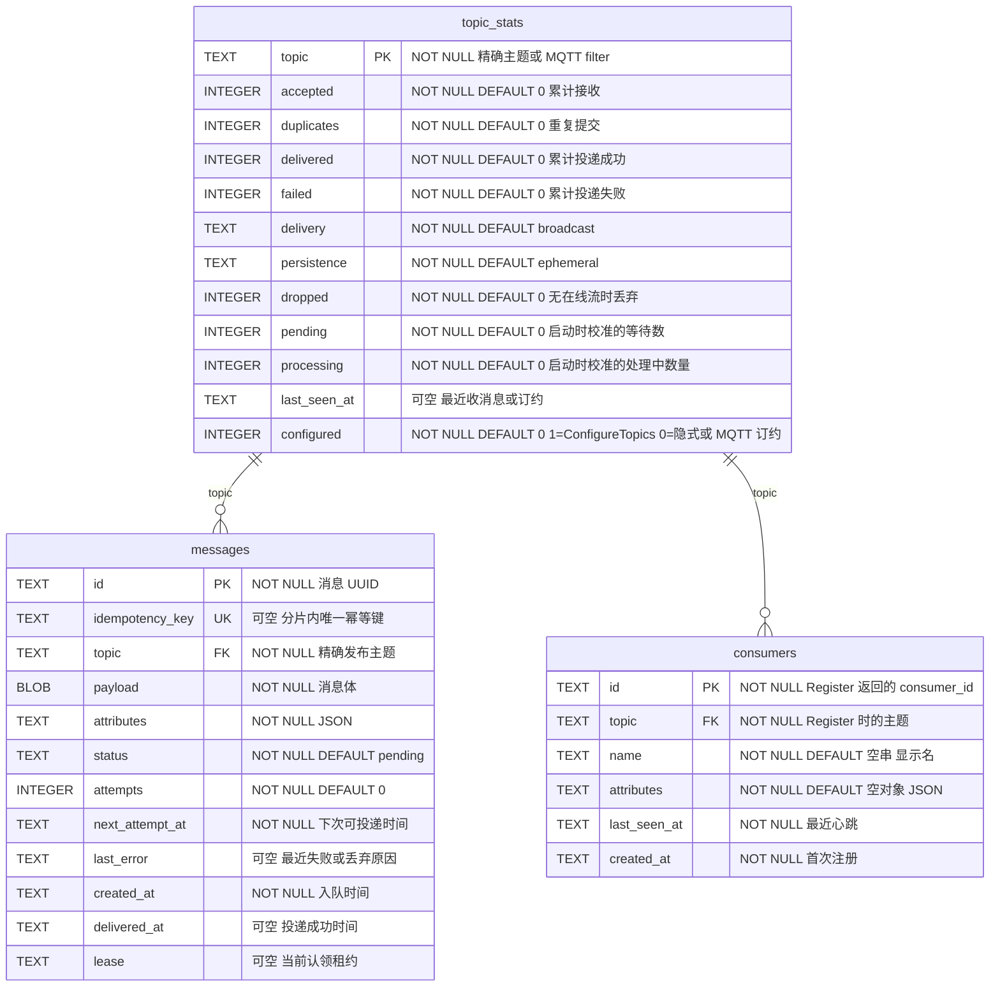

# cangling-broker

一个类 Kafka 的小型积木组件。生产者与消费者使用 **gRPC 流**，同一队列同时支持 TCP 与 WebSocket 上的 **MQTT 3.1.1**。服务会先把每次发布提交到 SQLite，再按主题模式投递。

未配置主题默认是 **broadcast**（广播）+ **ephemeral**（即弃）（MQTT 风格：每个在线流都收到一份；没人监听时发布即被丢弃）。把主题设为 **single**（单投）即竞争消费：每条消息只发给一个在线流。设为 **persistent**（持久）则先排队、稍后投递。`Register` 只保存额外的消费者元数据。当 **persistent** 主题没有在线流时，`DOWNSTREAM_URL` 是可选的 HTTP 回退。

生产环境请给 broker 设置 `CL_BROKER_AUTH_TOKEN`。客户端必须用相同的值发送 `authorization: Bearer <token>`（或 `--token` / `CL_BROKER_AUTH_TOKEN`）。不设置则 broker 保持开放。

## 运行

```bash
# 终端 1：broker
CL_BROKER_AUTH_TOKEN=change-me CL_BROKER_DATA=./data cargo run

# 终端 2：在 gRPC 流上消费
cargo run --example receiver
```

### Docker：启动 broker，再订阅、消费

客户端通过 gRPC 主动拨出，所以只需发布端口即可：

```bash
# 终端 1 — broker
docker run --rm --name cangling-broker \
  -p 7500:7500 -p 7501:7501 -p 7883:7883 -p 8083:8083 \
  -e CL_BROKER_AUTH_TOKEN=change-me \
  -v cangling-data:/data \
  docker.io/mapway/cangling-broker:latest
```

Harbor：

```bash
docker run --rm --name cangling-broker \
  -p 7500:7500 -p 7501:7501 -p 7883:7883 -p 8083:8083 \
  -e CL_BROKER_AUTH_TOKEN=change-me \
  -v cangling-data:/data \
  harbor.cangling.cn:22002/cangling/cangling-broker:latest
```

```bash
# 终端 2 — 订阅 / 消费（先 Register 元数据，再 Subscribe 流）
cd .test
../.venv/bin/python test_subscriber.py \
  --broker 127.0.0.1:7500 \
  --topic cangling-test \
  --name s0 \
  --token change-me
```

```bash
# 终端 3 — 在 AcceptMessages 流上发布一条消息
cd .test
../.venv/bin/python test_client.py \
  --broker 127.0.0.1:7500 \
  --topic cangling-test \
  --text hello \
  --count 1 \
  --token change-me
```

订阅者应打印 `s0 received | <message_id> | hello`。状态页：[http://127.0.0.1:7501/?token=change-me](http://127.0.0.1:7501/?token=change-me)。

Rust 消费者：

```bash
cargo run --example receiver -- --broker-addr http://127.0.0.1:7500 --topic cangling-test
```

镜像监听 `7500`（gRPC）、`7501`（状态页）、`7883`（MQTT TCP）、`8083`（MQTT WebSocket），SQLite 存放在 `/data`。如果想在宿主机使用标准 MQTT 端口，可映射 `1883:7883`。

### Java 客户端（`cn.mapway.broker`）

Maven 模块位于 [`java/`](java/)。坐标：`cn.mapway:cangling-broker`。在 `AcceptMessages` 上生产，在 `Subscribe` 上消费。`Register` 是可选元数据。

`SatwayClient.connect(...)` 会立即开始重连。通道保持存活；broker 宕机期间 `send` / `register` / `ack` 会带退避地重试；每个 `subscribe` 流断线后会用相同的 `consumer_id` 重新打开。调用 `close()` 停止。

当 broker 设置了 `CL_BROKER_AUTH_TOKEN`，请传入相同值：`SatwayClient.connect(broker, token)`、`--token`，或 `CL_BROKER_AUTH_TOKEN` 环境变量。客户端会在每次 RPC 上发送 `authorization: Bearer <token>`。

```xml
<dependency>
  <groupId>cn.mapway</groupId>
  <artifactId>cangling-broker</artifactId>
  <version>0.1.2</version>
</dependency>
```

```bash
cd java
mvn -q package
```

```bash
# 消费
mvn -q exec:java \
  -Dexec.mainClass=cn.mapway.broker.example.ConsumerMain \
  -Dexec.args="--broker 127.0.0.1:7500 --topic cangling-test --name java-s0 --token change-me"

# 生产
mvn -q exec:java \
  -Dexec.mainClass=cn.mapway.broker.example.ProducerMain \
  -Dexec.args="--broker 127.0.0.1:7500 --topic cangling-test --text hello --count 1 --token change-me"
```

在自己代码里：

```java
import cn.mapway.broker.Consumer;
import cn.mapway.broker.SatwayClient;
import cn.mapway.broker.SubscribeOptions;
import cn.mapway.broker.TopicConfig;

import java.util.List;

try (SatwayClient client = SatwayClient.connect("127.0.0.1:7500", "change-me", connected -> {
    connected.configureTopics(List.of(
            TopicConfig.single("jobs"),
            TopicConfig.ephemeral("live-events", TopicConfig.BROADCAST)));
})) {
    client.send("cangling-test", "hello");
    try (Consumer consumer = client.subscribe(
            SubscribeOptions.topic("cangling-test").name("worker-1").concurrency(10).build(),
            message -> System.out.println(message.id() + " " + message.payload()))) {
        Thread.currentThread().join();
    }
}
```

`onConnected` 在重连后也会再次执行，因此 broker 恢复后主题配置会重新应用。之后可用 `client.onConnected(...)` 注册；若通道已就绪，该监听器会立即执行。

`SubscribeOptions.concurrency(10)` 会打开十条并行订阅流。并发数大于一只应用于 `single` 主题，且消息处理器必须是线程安全的。`broadcast` 主题应保持默认并发数一，因为每条流都会收到一份消息。

### Python 客户端（`cangling_broker`）

模块位于 [`python/`](python/)。包名：`cangling-broker`。API 与 Java 一致：在 `AcceptMessages` 上生产，在 `Subscribe` 上消费。已发布到 [PyPI](https://pypi.org/project/cangling-broker/)。

```bash
pip install cangling-broker
```

```python
from cangling_broker import SatwayClient, SubscribeOptions

with SatwayClient.connect("127.0.0.1:7500", "change-me") as client:
    client.send("cangling-test", "hello")
    with client.subscribe(
            SubscribeOptions(topic="cangling-test", name="worker-1"),
            lambda message: print(message.id, message.payload)):
        ...
```

```bash
# 消费
python python/examples/consumer.py --broker 127.0.0.1:7500 --topic cangling-test --name py-s0 --token change-me

# 生产
python python/examples/producer.py --broker 127.0.0.1:7500 --topic cangling-test --text hello --count 1 --token change-me
```

CI 只在 `v*` tag push 时运行（也就是执行 `./release.sh` 时）。它在 **x86_64**（`ubuntu-latest`）与 **aarch64**（`ubuntu-24.04-arm`）上编译并缓存 Cargo 产物，然后发布 Docker、Maven Central 与 PyPI。普通提交、分支 push 与 pull request 不会触发 CI。镜像：

- `docker.io/mapway/cangling-broker:latest`
- `harbor.cangling.cn:22002/cangling/cangling-broker:latest`

### 发布

```bash
./release.sh
```

每次运行会把 `Cargo.toml`、`java/pom.xml`、`python/pyproject.toml` 里的补丁版本号加一（`0.1.0` → `0.1.1`），提交 `Release v0.1.1`，打 tag `v0.1.1` 并推送两者。workflow 只在 `v*` tag push 时触发，因此分支提交不会运行 CI。不要在提交上放 `[skip ci]`：那样 GitHub 也会跳过 tag push。tag 运行负责编译并发布 Docker、`cn.mapway:cangling-broker` 到 Maven Central，以及 `cangling-broker` 到 PyPI。Docker 镜像不从 `main` 发布。

配置这些仓库 secrets：

| Secret | 用途 |
| --- | --- |
| `DOCKERHUB_USERNAME` | Docker Hub 登录 |
| `DOCKERHUB_TOKEN` | Docker Hub 访问令牌 |
| `HARBOR_USERNAME` | Harbor 用户或机器人账号 |
| `HARBOR_PASSWORD` | Harbor 密码或机器人令牌 |
| `CENTRAL_USERNAME` | Maven Central user-token 用户名 |
| `CENTRAL_PASSWORD` | Maven Central user-token 密码 |
| `GPG_PRIVATE_KEY` | 用于给 jar 签名的 armored GPG 私钥 |
| `GPG_PASSPHRASE` | 该 GPG 密钥的密码 |
| `PYPI_API_TOKEN` | 发布 `cangling-broker` 的 PyPI API token |

gRPC API 定义见 [`proto/queue.proto`](proto/queue.proto)。用你喜欢的语言从该契约生成客户端；端点默认是 `127.0.0.1:7500`。

Broker 内部接口在单独的 HTTP 端口上（`CL_BROKER_WEBPORT`，默认 `7501`）：

```bash
# 仪表盘（设置了 CL_BROKER_AUTH_TOKEN 时请带上 token）
open 'http://127.0.0.1:7501/?token=change-me'

curl -s http://127.0.0.1:7501/health
curl -s -H 'authorization: Bearer change-me' http://127.0.0.1:7501/status
```

`/` 是单个 HTML 页面，从 `/status` 刷新。`/status` 是 JSON，包含 `version`、`git`、`built` 以及 `db_bytes`（管理库、16 个消息分片及全部 WAL/SHM 的磁盘占用）。每个 `clients[]` 条目在客户端发送了 `x-client-version` 时包含 `version`（Java/Python SDK 会自动发送）；对 MQTT 则是协议版本（`3.1` / `3.1.1`）。官方 SDK 也会发送 `x-client-host`（Docker `HOSTNAME`，或用 `CL_BROKER_CLIENT_HOST` 覆盖），这样当容器都经同一网关 IP 做 NAT 时，仪表盘能区分它们。`consumers` / `streams` 是存活的 `Subscribe` 流数量。仪表盘卡片 **SQLite** 显示同样的占用大小。点击 **persistent** 主题可打开其消费者并浏览已保存消息（`GET /messages?topic=...&offset=0`，offset `0` 为最新）。即弃主题不保存消息体。主题行上的 **清空** 会删除该主题的消息（`DELETE /messages?topic=...`）并重置其计数。

页头现在链接到三个页面：**消息**（状态概览、已连接客户端、主题及按主题浏览消息）、**缓存**（缓存的按键查询 / 写入 / 删除 / 自增，以及完整键列表）与 **分布式锁**（锁状态 / 获取 / 续期 / 释放，以及完整锁列表）。缓存与锁页面分别从 `GET /cache/keys` 与 `GET /lock/list` 刷新。

在反向代理的 `/msg/` 路径后，打开 `/msg/?token=change-me`。页面会调用自身旁边的 `status`（`/msg/status`），而不是站点根部的 `/status`。如果 nginx 去掉了前缀（`proxy_pass http://broker:7501/;`），这就够了。如果代理原样转发 `/msg/status`，请设置 `CL_BROKER_WEB_BASE=/msg`，broker 也会在该前缀下提供仪表盘与 JSON。

### 竞争消费

```bash
# 同一主题两个 worker —— 每条消息只在一个 Subscribe 流上发送
cd .test
../.venv/bin/python test_subscriber.py --topic cangling-test --name s0
../.venv/bin/python test_subscriber.py --topic cangling-test --name s1

# 发布
../.venv/bin/python test_client.py --text hello --count 1
```

在 **single** 主题上，每条消息被一个在线流认领。在 **broadcast** 主题上，每个在线流都收到一份；消息在所有流都 ack 后才算投递完成。如果订阅者断开，或在 `ACK_TIMEOUT_SECS` 之前没有确认，该投递会被重试。当前 Java/Python SDK 会在最多 2ms 或 64 条消息内合并确认并调用 `AckMessages`；旧客户端仍可使用 `AckMessage`。用 `message_id` 保证处理幂等。投递是至少一次（at-least-once）。

### 第二阶段性能优化

- 新增向后兼容的 `AckMessages` 批量确认接口，Java/Python SDK 异步合并 ACK。
- 持久化消息提交后按 topic 主动唤醒订阅者；30 秒轮询仅作为异常恢复兜底。
- pending/processing 改为内存增量统计，启动时从 SQLite 校准；`/status` 不再对整张 `messages` 表执行 `GROUP BY topic,status`。

2026-09-26 在同一台 release 测试机预装 10,000 条 256B 持久化消息，再由 4 个 Python 消费者清空：旧版逐条 unary ACK 为 **253.9 msg/s**，批量 ACK 为 **275.3 msg/s**，提升 **8.4%**；最终 delivered=10,000、pending=0、processing=0。该 A/B 测试专门隔离 ACK 协议开销，与 README 英文版中生产和消费同时进行的第一阶段压测不是同一种负载。

持久化消息固定使用 **16 个 SQLite 分片**：`queue-00.db`～`queue-15.db`。精确 topic 通过稳定的 FNV-1a 哈希定位，因此重启和升级后仍进入同一个分片，并保持单 topic 顺序。每个分片有独立的有界批量写队列和 WAL；总队列容量在 16 个分片间分配，不会放大 16 倍。精确 topic 只访问一个文件，通配订阅轮转查询全部分片。新消息 ID 带 `s07-...` 形式的分片前缀，ACK 可直接定位。

首次升级会把旧 `queue.db.messages` 内容复制到分片、逐条验证，再写入 `message-shards-v1` 标记。旧数据作为回滚副本保留，不再参与运行；系统不会自动执行破坏性删除。

分片提交热路径不再同步更新管理库。accepted、duplicate 和 delivered 统计先在内存中聚合，每 100ms 用一个事务批量刷新到 `queue.db`；状态查询、清理任务和正常关闭会强制执行最终刷新。队列深度仍是即时内存计数，启动时从全部分片重新校准。

2026-09-26 使用 Release 构建、256B 持久化消息和本地磁盘复测：单条生产流在多次 32,000 条测试中达到 12,324～16,887 msg/s；保持 16 条并发生产流不变时，全部写入同一分片为 3,317 msg/s，分别写入 16 个分片为 5,050 msg/s，提升 52%。这说明相同生产并发下分片有效，但同一物理磁盘上的多 WAL 写入和额外流调度不会线性扩展，部署前仍应在目标存储卷上复测。

### 主题投递模式

未配置主题是 `broadcast` + `ephemeral`。可一次配置多个主题：

```bash
curl -s -H 'authorization: Bearer change-me' \
  -H 'content-type: application/json' \
  -d '{"topics":[
        {"topic":"jobs","delivery":"single","persistence":"persistent"},
        {"topic":"alerts","delivery":"broadcast","persistence":"persistent"},
        {"topic":"live-events","delivery":"broadcast","persistence":"ephemeral"}
      ]}' \
  http://127.0.0.1:7501/topics

curl -s -H 'authorization: Bearer change-me' http://127.0.0.1:7501/topics
```

gRPC：`ConfigureTopics` / `ListTopics`。Java：`client.configureTopics(List.of(TopicConfig.broadcast("alerts"), TopicConfig.single("jobs"), TopicConfig.ephemeral("live-events", TopicConfig.BROADCAST)))`。Python：`client.configure_topics([TopicConfig("alerts", "broadcast"), TopicConfig("jobs", "single"), TopicConfig("live-events", "broadcast", "ephemeral")])`。

### 主题持久化

在 **persistent** 主题上，broker 保存消息并稍后投递，包括在无人订阅时通过 `DOWNSTREAM_URL` 投递。配置 `persistence` 可启用；未配置主题保持即弃。

在 **ephemeral** 主题上，broker 只投递给存活的 `Subscribe` 流。如果发布时无人连接，消息被丢弃（不排队，也无 HTTP 回退）。后来的订阅者收不到那些被丢弃的消息。`delivery` 仍适用于已连接者之间：`single` 发给一个在线流，`broadcast` 发给每个在线流一份。

## 投递契约

消费者在 `Subscribe` 流上收到一个 `SatwayMessage`：

```json
{
  "message_id": "uuid",
  "topic": "hazard-detection",
  "payload": "...",
  "attributes": { "projectId": "p-123" },
  "created_at": "2026-08-14T00:00:00Z",
  "lease": "claim-token"
}
```

用该 `message_id` 和 `lease` 调用 `AckMessage`。`success = true` 标记消息已投递；`success = false` 或超时会重新入队。这是 **至少一次投递**：接收方应使用 `message_id` 保证处理幂等。在 `AcceptMessages` 上传入 `idempotency_key` 可让生产者重试安全。

## 缓存与锁（Redis 替代）

broker 还提供一个小型 Redis 替代：带 TTL 与原子自增的 **内存** 字符串 KV 缓存，加上 **基于 SQLite 的** 分布式锁。它通过 gRPC（`dispatcher.v1.CacheService`）与状态端口的 `/cache*`、`/lock*` 暴露。值为二进制安全字节；`Incr` 把已存值当作整数处理。

缓存保存在进程内存中（完全不碰 SQLite），因此读写都很快。其容量由 `CL_BROKER_CACHE_MAX_ENTRIES`（默认 100000）限制；满时逐出最久未访问的条目。缓存条目 **不** 持久化，broker 重启即丢失。锁则相反，保存在 SQLite 上，因此重启不会悄悄丢掉正在运行的任务持有的租约。

TTL 语义对齐 Redis：`Ttl` 对不存在的键返回 `-2`，对永不过期的键返回 `-1`，否则返回剩余秒数。锁需要 `owner` 令牌；`release` 与 `renew` 只对持有该锁的 owner 生效，租约不会超过其 `ttl_seconds`（因此崩溃的持有者不会让其他人死锁）。

HTTP（使用与仪表盘其余部分相同的 Bearer token）：

```bash
curl -s -H 'authorization: Bearer change-me' 'http://127.0.0.1:7501/cache?key=jobs:count'
curl -s -H 'authorization: Bearer change-me' 'http://127.0.0.1:7501/cache/keys'
curl -s -X PUT -H 'authorization: Bearer change-me' -H 'content-type: application/json' \
  -d '{"key":"session:u1","value":"hello","ttl_seconds":300}' http://127.0.0.1:7501/cache
curl -s -X POST -H 'authorization: Bearer change-me' -H 'content-type: application/json' \
  -d '{"key":"jobs:count","delta":1,"ttl_seconds":60}' http://127.0.0.1:7501/cache/incr
curl -s -X POST -H 'authorization: Bearer change-me' -H 'content-type: application/json' \
  -d '{"lock_key":"import:dataset","owner":"u1","ttl_seconds":30}' http://127.0.0.1:7501/lock/acquire
curl -s -H 'authorization: Bearer change-me' 'http://127.0.0.1:7501/lock/list'
curl -s -X DELETE -H 'authorization: Bearer change-me' \
  'http://127.0.0.1:7501/lock?lock_key=import:dataset&owner=u1'
```

`GET /cache/keys` 返回全部存活缓存条目，`GET /lock/list` 返回全部存活锁。

Java：

```java
try (SatwayClient client = SatwayClient.connect("127.0.0.1:7500", "change-me")) {
    client.cacheSet("session:u1", "hello", 300);
    String value = client.cacheGetString("session:u1");
    long n = client.cacheIncr("jobs:count", 1, 60);
    try (LockHandle lock = client.acquireLock("import:dataset", 30)) {
        if (lock != null) lock.renew(30);
    }
}
```

Python：

```python
with SatwayClient.connect("127.0.0.1:7500", "change-me") as client:
    client.cache_set("session:u1", "hello", ttl_seconds=300)
    value = client.cache_get_string("session:u1")
    n = client.cache_incr("jobs:count", 1, ttl_seconds=60)
    lock = client.acquire_lock("import:dataset", 30)
    if lock:
        with lock:
            lock.renew(30)
```

## 配置

| 环境变量 | 默认值 | 用途 |
| --- | --- | --- |
| `CL_BROKER_PORT` | `7500` | gRPC 监听 `0.0.0.0:<port>` |
| `CL_BROKER_WEBPORT` | `7501` | HTTP 状态/仪表盘（`GET /`、`GET /status`、`GET /health`、`GET /messages`、`/cache*`、`/lock*`） |
| `CL_BROKER_WEB_BASE` | 不设置 | 可选路径前缀（`/msg`），当代理原样转发 `/msg/...` 时使用。`/` 与 `/health` 仍留在根部 |
| `CL_BROKER_MQTT_ENABLED` | `true` | 接受 MQTT 3.1.1 客户端；`false` 禁用两个 MQTT 监听 |
| `CL_BROKER_MQTT_PORT` | `7883` | MQTT TCP 监听。`0` 禁用 TCP。默认是非特权端口；映射 `1883:7883`，或能绑定就设 `1883` |
| `CL_BROKER_MQTT_WSPORT` | `8083` | MQTT WebSocket 监听（`/mqtt`）。`0` 把 `GET /mqtt` 挂到状态端口 |
| `CL_BROKER_AUTH_TOKEN` | 不设置 | 共享密钥；设置后，gRPC、`/` `/status` 与 MQTT `CONNECT` 都需要它。`/health` 保持开放 |
| `CL_BROKER_DATA` | 不设置（镜像：`/data`） | 数据目录；管理库为 `<dir>/queue.db`，消息库为 `queue-00.db`～`queue-15.db`，日志在 `<dir>/logs` |
| `DOWNSTREAM_URL` | 不设置 | 主题没有在线 `Subscribe` 流时的可选 HTTP POST 回退 |
| `WORKER_POLL_MS` | `500` | 队列轮询间隔 |
| `CL_BROKER_WRITE_BATCH_SIZE` | `128` | 单写入器一次合并的持久化入队/完成操作上限 |
| `CL_BROKER_WRITE_BATCH_WAIT_MS` | `2` | 收集一批写操作的最长等待毫秒数 |
| `CL_BROKER_WRITE_QUEUE_SIZE` | `8192` | 触发生产者背压前的内存写队列容量 |
| `CL_BROKER_INGEST_INFLIGHT` | `128` | 每条 gRPC 生产流并发处理的发布上限；响应保持顺序 |
| `CL_BROKER_CONSUMER_PREFETCH` | `32` | 每个订阅允许的未确认持久化消息数；严格串行投递可设为 `1` |
| `MAX_DELIVERY_ATTEMPTS` | `10` | 消息标记为失败前的尝试次数 |
| `MESSAGE_RETENTION_DAYS` | `10` | 删除超过此天数的消息（任意状态，按 `created_at`）；`0` 永久保留 |
| `CL_BROKER_DELIVERED_RETENTION_HOURS` | `24` | 删除 `delivered_at` 超过此时长的已投递消息；`0` 禁用。pending、failed、dropped 行仍按 `MESSAGE_RETENTION_DAYS` 保留 |
| `CL_BROKER_EPHEMERAL_IDLE_HOURS` | `1` | 删除超过此时长无新消息的未配置即弃主题行；`0` 禁用。`ConfigureTopics` 行会保留 |
| `CL_BROKER_PURGE_INTERVAL_HOURS` | `1` | 空闲主题清理的执行频率；`0` 在每 60 秒清扫时都执行 |
| `ACK_TIMEOUT_SECS` | `30` | 订阅者在消息被重试前可用来 `AckMessage` 的时长 |
| `CONSUMER_TTL_SECS` | `60` | 删除不再出现的已注册消费者元数据；`0` 保留到 `Unregister` |
| `CL_BROKER_CACHE_MAX_ENTRIES` | `100000` | 内存缓存 LRU 逐出前的最大条目数 |
| `LOG_MAX_BYTES` | `104857600` | 达到此字节数（100 MiB）后轮转 |
| `LOG_KEEP_FILES` | `3` | 保留的文件数，含当前文件 |
| `CL_BROKER_LOG_MESSAGES` | `false` | 为 `true` 时，把每条收到消息的主题和消息体打印到控制台 |

```bash
docker run --rm --name cangling-broker \
  -p 7500:7500 -p 7501:7501 -p 7883:7883 -p 8083:8083 \
  -e CL_BROKER_AUTH_TOKEN=hello_world \
  -e CL_BROKER_PORT=7500 \
  -e CL_BROKER_WEBPORT=7501 \
  -e CL_BROKER_DATA=/data \
  -v cangling-data:/data \
  docker.io/mapway/cangling-broker:latest
```

### MQTT（TCP + WebSocket）

MQTT 3.1.1，QoS 0/1。发布与订阅和 gRPC 共用同一个 SQLite 队列。主题过滤器支持精确名、单层 `+` 与多层 `#`（`building/#` 会收到 `building`、`building/floor1/temp`、……）。`#` 必须是最后一级。Retain、LWT 与 QoS 2 未实现：收到的 QoS 2 会以 `PUBREC`/`PUBCOMP` 应答，但和 QoS 1 一样只存一次。

设置 `CL_BROKER_AUTH_TOKEN` 时，把它作为 MQTT 密码（或用户名）发送。

```bash
# 订阅（TCP）
mosquitto_sub -h 127.0.0.1 -p 7883 -t 'building/#' -P change-me

# 发布（TCP）
mosquitto_pub -h 127.0.0.1 -p 7883 -t cangling-test -m hello -q 1 -P change-me
```

浏览器 / mqtt.js：

```js
import mqtt from "mqtt";
const client = mqtt.connect("ws://127.0.0.1:8083/mqtt", { password: "change-me" });
client.subscribe("cangling-test");
client.publish("cangling-test", "hello");
```

gRPC `AcceptMessages` 的发布会投递给该主题的 MQTT 订阅者，反之亦然。

## 数据库 ER

`topic_stats`、`consumers` 和管理表位于 `<data>/queue.db`；`messages` 表位于固定的 16 个 `queue-NN.db` 分片中。没有声明跨库 `FOREIGN KEY`，逻辑外键是 `topic`。列、默认值和索引以 `src/db.rs` 为准。

`topic_stats.topic` 可以是精确名，也可以是 MQTT 订约 filter（`building/#`、`sensor/+/temp`）。`messages.topic` 永远是精确发布名。通配符订约会单独占一行 `topic_stats`（`persistence=persistent`，`configured=0`），这样 idle purge 不会删掉已订约的 filter；发布出来的子主题（如 `building/floor1/temp`）仍按 ephemeral 处理，空闲后可被回收。



`status`：`pending` / `processing` / `delivered` / `failed` / `dropped`（进程启动时会把仍为 `processing` 的行改回 `pending` 并清空 `lease`）。`delivery`：`single` 或 `broadcast`。`persistence`：`persistent` 或 `ephemeral`。

索引：

| 名称 | 列 |
| --- | --- |
| `idx_messages_ready` | `messages(status, next_attempt_at, created_at)` |
| `idx_messages_created_at` | `messages(created_at)` |
| `idx_messages_delivered` | `messages(status, delivered_at)` |
| `idx_messages_topic_ready` | `messages(topic, status, next_attempt_at, created_at)` |
| `idx_consumers_topic_seen` | `consumers(topic, last_seen_at)` |
| `messages.idempotency_key` | `UNIQUE` |

`consumers` 只存 gRPC `Register` 元数据。投递走内存里的 `Subscribe` / MQTT 会话；MQTT 订约本身写入 `topic_stats`，不写 `consumers`。`messages.idempotency_key` 在 topic 所在分片内唯一，用于 `AcceptMessages` 去重；生产者重试时必须保持同一个 topic。隐式 ephemeral 且空闲超过 `CL_BROKER_EPHEMERAL_IDLE_HOURS` 的行会被 purge 删掉；`configured=1` 和 MQTT 订约的 persistent filter 会留下。已投递且 `delivered_at` 超过 `CL_BROKER_DELIVERED_RETENTION_HOURS` 的消息行会被删掉；未投递的行仍按 `MESSAGE_RETENTION_DAYS` 清理。
